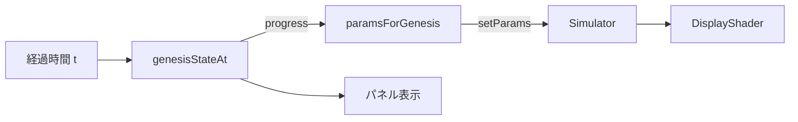

# Phase 2 まとめ: 成因ドライバ

完了日: 2026-06-25 / Issue #7 / PR #8（squash マージ済み）

## 何を作ったか

Phase 1 で動いていた Gray-Scott 反応拡散は、パラメータが `CORAL` 固定で「ただ模様が出るだけ」だった。
Phase 2 では、**経過時間に応じて「冷却 → 過飽和 → 核生成 → 結晶成長」へパラメータを遷移**させ、
反応拡散の模様を「鉱石が生まれる物語」と接続した。

起動直後は静穏（模様がほぼ出ない）→ 時間が進むと過飽和を超えてサンゴ状に育ち始める、という流れになる。

## 物語とパラメータの対応

| 経過 t | 成因の状態 | Gray-Scott |
|---|---|---|
| 0 付近 | 高温・未過飽和（静穏） | `QUIESCENT`（kill 高め＝生成物が育たない） |
| 中盤 | 過飽和・核生成 | QUIESCENT→GROWTH の補間 |
| 1 付近 | 過冷却・結晶成長 | `GROWTH`（旧 CORAL と同値） |

`progress`（しきい値を下回ってからの冷え込み量 0..1）で 2 プリセットを線形補間し、
「冷えるほど成長が活発になる」物語を 1 本の式で表している。

## 設計（なぜこの形か）

### レイヤーと依存の向き

- **domain/genesis.ts** … 成因ロジック（温度・過飽和・パラメータ補間）。**WebGL に一切依存しない純粋関数**。
  `GrayScottParams` 型の唯一の定義元もここに置いた。
- **core/Simulator.ts** … domain の型を参照して GPU を回す（依存の向き core → domain）。
- **main.ts** … 合成ルート。rAF ループで時間を domain に渡し、結果を Simulator とパネルに配る。

> なぜ型を domain に集約したか: 「物理（domain）が中心、WebGL（infrastructure）は外側」というクリーンアーキの
> 依存ルールを守るため。core が domain に依存する向きなら、domain は GPU の都合を知らずに済み、テストも軽い。

### Simulator の変更
- `params` を `readonly` → 可変にし、`setParams()` を追加。
- 責務は「1 ステップ進める」のままで、パラメータ差し替えの口を 1 つ足しただけ（SRP 維持）。
- バッファ・状態テクスチャは保持したまま、次の `step` から新パラメータが効く。

## ここは信頼してよい（スコープ境界）

- **domain の純粋関数**: 単体テスト 12 件が緑。数値ロジックはテストが守っているので、
  呼び出し側は「t を渡せば妥当なパラメータが返る」と信頼してよい。
- **core / render の WebGL 配線**: Phase 1 で動作確認済み。Phase 2 では `setParams` 追加のみ。
- 触る必要が出るのは主に **main.ts の定数**（下記）と **domain のプリセット値**。

## 調整ポイント（見た目を変えたい時はここ）

`src/main.ts` 冒頭の定数:
- `GENESIS_DURATION_MS`（既定 45000）… 何秒で冷え切るか
- `GENESIS_OPTS`（`coolingRate` / `threshold`）… 冷却の急峻さと析出開始温度
- `STEPS_PER_FRAME`（既定 8）… 1 フレームの計算ステップ数（成長の速さ）

`src/domain/genesis.ts` の `QUIESCENT`（dt を上げ下げ＝静穏の深さ）/ `GROWTH`（feed/kill で模様の質感）。
※ 冷却レバーは **dt** に持たせている。kill を静穏に使うと種(V) が死んで真っ黒になるため（下記）。

## 実機で見つかった不具合と修正（#11 → #12 → #13）

初回の実機目視で「起動後ずっと真っ黒」だった。
原因は旧 `QUIESCENT`(kill=0.07) が Gray-Scott の **V 消滅領域**で、中央の種 V が死に、
反応項 `U·V²=0` で二度と再生せず GROWTH に遷移しても黒のままだったこと。
冷却レバーを **kill → dt** へ変更（`QUIESCENT = {...GROWTH, dt: 0.15}`）して、
種を殺さずに「冷えると反応が速くなる」物語へ修正した。
詳細と一般化した教訓は `knowledge/01-grayscott-seed-death.md` を参照。

## 検証結果

- `npm test` … 2 files / 14 tests 緑（致死域回避・dt 単調増加の再発防止テスト含む）
- `npm run build` … tsc + vite ビルド成功（dist 出力）
- **実機目視（#11）** … 起動直後ほぼ静止 → 核生成 → サンゴ状に成長を確認済み

## 残課題

- Phase 3 以降: 結晶成長 CA（対称性に応じたファセット）／鉱物ごとの結晶形（research/01 参照）。
